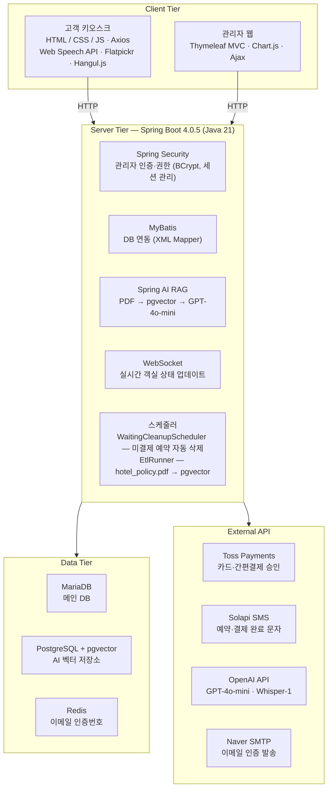
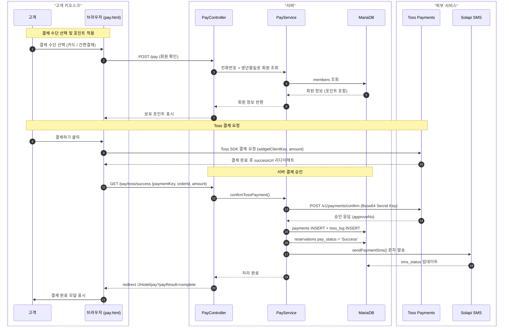
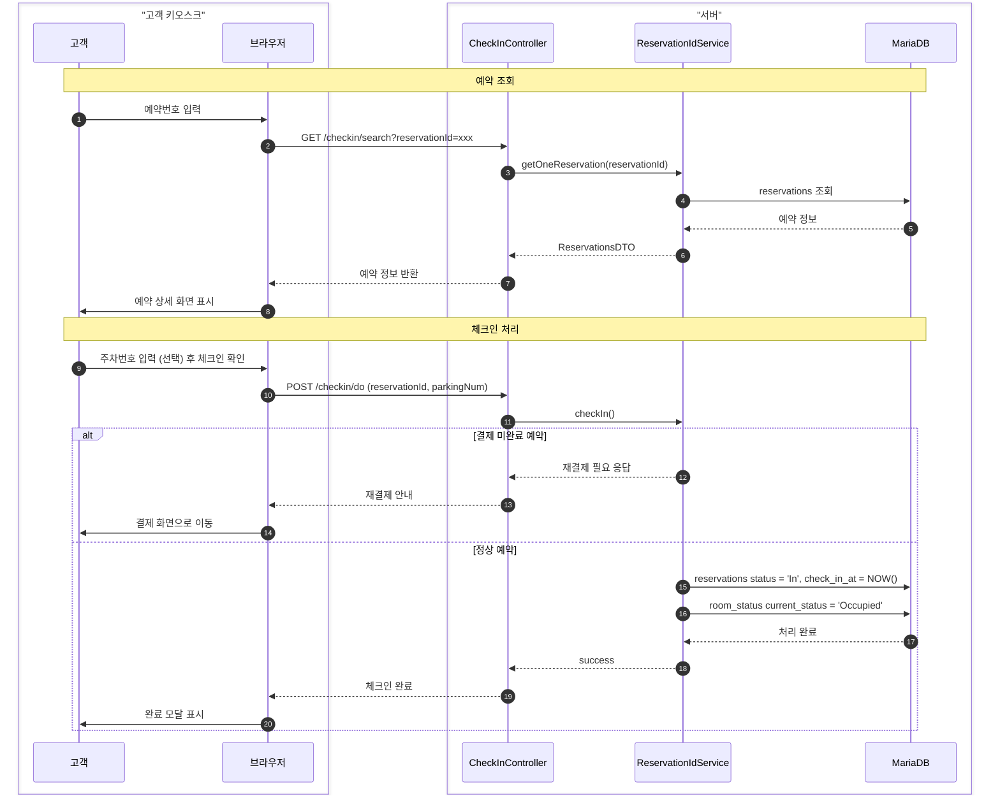
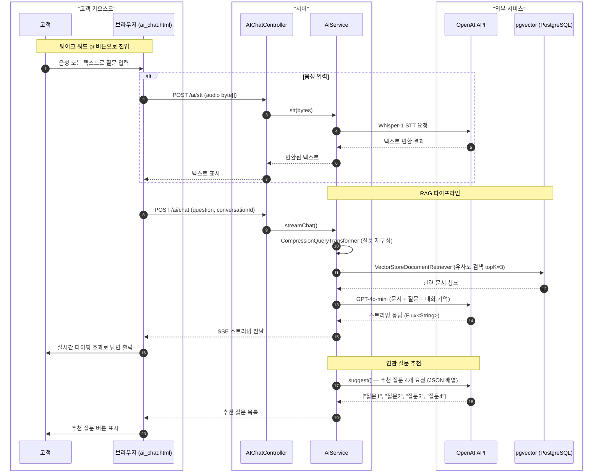

# J Hotel 무인 키오스크 시스템


> 호텔 고객의 비대면 체크인·예약·결제부터 관리자 운영 관리까지 통합한 무인 키오스크 시스템

---

## 목차

1. [프로젝트 개요](#1-프로젝트-개요)
2. [팀원 및 역할](#2-팀원-및-역할)
3. [기술 스택](#3-기술-스택)
4. [기술 의사결정](#4-기술-의사결정)
5. [시스템 아키텍처](#5-시스템-아키텍처)
6. [주요 기능](#6-주요-기능)
7. [핵심 기술 구현](#7-핵심-기술-구현)
8. [시퀀스 다이어그램](#8-시퀀스-다이어그램)
9. [ERD](#9-erd)
10. [데이터베이스 설계](#10-데이터베이스-설계)
11. [프로젝트 구조](#11-프로젝트-구조)
12. [실행 방법](#12-실행-방법)
13. [트러블슈팅](#13-트러블슈팅)
14. [팀 소감](#14-팀-소감)
15. [팀 문서](#15-팀-문서)
16. [API 문서](#16-api-문서)

---

## 1. 프로젝트 개요

### 개발 배경

최근 호텔 산업은 비대면 서비스 수요 증가, 운영 효율화 필요, 인력 부족 문제에 직면해 있습니다. 기존 프런트 데스크 중심의 체크인·체크아웃 업무 방식은 고객 대기 시간 증가, 직원 과부하, 운영 비용 상승이라는 문제를 야기했습니다. 이에 따라 호텔 운영 전반을 디지털화하고 고객 경험을 개선하기 위한 무인 키오스크 시스템의 필요성이 대두되었습니다.

### 목적

- **고객 편의성 향상** : 예약 조회·체크인·결제까지 모든 절차를 키오스크 하나로 처리, 음성 인식 AI로 접근성 확보, 타임아웃 복귀·개인정보 자동 삭제로 안전한 사용자 경험 제공
- **운영 효율성 강화** : 체크인·예약·결제 자동화로 프런트 데스크 업무 부담 감소, 실시간 객실·재고·예약 현황을 관리자 페이지에서 즉시 확인
- **안정성·보안성 확보** : 결제 오류 및 타임아웃 발생 시 자동 취소·복귀, 비밀번호 BCrypt 암호화, 세션 관리, 데이터 무결성 보장

**개발 기간** : 2026년 4월 ~

---

## 2. 팀원 및 역할

| 이름 | 기획 | 백엔드 | DB | 프론트엔드 |
|------|------|--------|----|-----------|
| 박재경 | 요구사항 정의서, AI 서비스 설계 | AI 챗봇 (RAG 파이프라인, pgvector), Spring Security, 이메일 인증, Swagger API 문서화 | pgvector 스키마 | AI 채팅 화면 |
| 손민정 | 스토리보드, 유스케이스 | 현장 예약·숙박 연장 프로세스, 세션 타임아웃·개인정보 보호, 웨이크 워드 연동 | reservations, options_record | 예약 플로우 전체, 터치 키보드 |
| 진혜림 | 테이블 정의서, 유스케이스 | 체크인 구현, Toss Payments 연동, 포인트 적립·사용, 공지 안내 화면 | payments, members_point, toss_log | 체크인·결제 화면, 공지 화면 |
| 한정수 | 스토리보드 | 관리자 웹 전체 (대시보드, 객실·예약·고객·재고 관리), 통계 시각화 | 관리자 관련 전체 | 관리자 웹 전체 |

---

## 3. 기술 스택

| 구분 | 기술 | 버전 |
|------|------|------|
| Language | Java | 21 |
| Framework | Spring Boot | 4.0.5 |
| Template Engine | Thymeleaf | - |
| ORM | MyBatis | 4.0.1 |
| Security | Spring Security | - |
| DB (Main) | MariaDB | - |
| DB (Vector) | PostgreSQL + pgvector | - |
| Cache | Redis | 7 |
| AI Framework | Spring AI | 2.0.0-M4 |
| LLM | OpenAI GPT-4o-mini | - |
| Embedding | OpenAI text-embedding-3-small | - |
| STT | OpenAI Whisper-1 | - |
| 결제 | Toss Payments | - |
| SMS | Solapi SDK | 1.0.3 |
| 이메일 | Naver SMTP | - |
| API 문서 | Springdoc OpenAPI (Swagger) | 3.0.2 |
| 객체 매핑 | ModelMapper | 3.2.5 |
| 비동기 통신 | Axios | - |
| 날짜 선택 | Flatpickr | - |
| 한글 입력 | Hangul.js | - |
| Build | Gradle | - |
| Container | Docker + Docker Compose | - |

---

## 4. 기술 의사결정

### Spring Boot 4.x

Spring MVC, Security, MyBatis, WebSocket 등 호텔 키오스크에 필요한 모든 기능이 하나의 생태계 안에 통합되어 있습니다. 복잡한 인증·권한 구조(관리자 등급 분리, 계정 상태 관리)와 외부 API 연동(Toss, Solapi, OpenAI)을 구현하는 데 Spring의 DI와 AOP가 생산성을 크게 높여줬습니다.

### MyBatis (vs JPA)

예약 가능 객실 조회, 요금 정책 적용, 통계 집계 등 복잡한 조인과 동적 쿼리가 많습니다. JPA로 이를 처리하면 N+1 문제나 복잡한 JPQL이 불가피합니다. MyBatis는 SQL을 직접 작성하므로 쿼리 최적화가 직관적이고, XML Mapper로 SQL을 코드에서 분리해 유지보수도 편합니다.

### Redis (이메일 인증)

이메일 인증번호는 수 분의 유효 시간이 지나면 자동으로 폐기되어야 합니다. RDB에 저장하면 만료 처리를 별도 스케줄러로 구현해야 하지만, Redis는 TTL만 설정하면 자동 만료됩니다. 인증번호처럼 임시 데이터를 처리하는 데 가장 적합한 선택입니다.

### Spring AI + pgvector (RAG)

고객이 호텔 정책을 물어볼 때 LLM에게 단순 질문을 보내면 정확하지 않은 답변이 나올 수 있습니다. RAG(Retrieval-Augmented Generation) 방식으로 호텔 정책 PDF를 벡터화해 저장해두고, 질문과 유사한 문서만 검색해 LLM에 함께 전달함으로써 도메인 특화된 정확한 답변을 생성할 수 있습니다. pgvector는 PostgreSQL 확장으로 별도 인프라 없이 벡터 저장소를 구축할 수 있어 선택했습니다.

### OpenAI Whisper (STT)

터치 전용 키오스크 환경에서 음성 입력은 접근성을 크게 높여줍니다. Web Speech API는 브라우저 내장 STT이지만 인터넷 환경이나 브라우저 종류에 따라 정확도 차이가 큽니다. Whisper는 정확도가 높고 한국어를 잘 지원하며, 이미 OpenAI API를 사용하는 인프라에서 추가 비용 없이 통합할 수 있습니다.

### Toss Payments

국내 호텔 고객을 대상으로 하는 서비스이므로 카카오페이, 네이버페이 등 국내 간편결제를 폭넓게 지원하는 PG사가 필요했습니다. Toss Payments는 위젯 SDK로 결제 UI를 간단하게 삽입할 수 있고, 승인 API 문서가 명확해 서버 사이드 연동이 수월합니다.

### Solapi (SMS)

예약 완료 후 고객에게 예약 정보를 즉시 문자로 전달하여 신뢰도를 높입니다. Solapi는 Java SDK를 공식 지원하고, 국내 SMS 발송에 안정적이며 발송 실패 케이스도 SDK 자체 예외로 세분화되어 있어 상태 관리가 편합니다.

### BCrypt (비밀번호 암호화)

단방향 해시로 복호화가 불가능하고, 솔트가 자동 적용되어 동일한 비밀번호도 매번 다른 해시값이 생성됩니다. 관리자 비밀번호처럼 민감한 정보를 안전하게 보호하는 데 가장 검증된 방식입니다. Spring Security에 기본 통합되어 별도 구현 없이 `BCryptPasswordEncoder`를 바로 사용할 수 있습니다.

---

## 5. 시스템 아키텍처



---

## 6. 주요 기능

### 6-1. 고객용 키오스크

#### 대기 화면 / 메인 화면
- 일정 시간 미조작 시 대기 화면(홍보 이미지 무한 루프)으로 자동 복귀
- 화면 터치 시 메인 화면 진입, 언어 선택(선택사항) 후 서비스 선택

#### 현장 예약
1. 숙박 기간(체크인·체크아웃 날짜) 및 인원 설정 (Flatpickr 캘린더)
2. 조건에 맞는 예약 가능 객실 실시간 조회 (정렬·필터 선택 가능)
3. 원하는 객실 선택 후 부가 서비스 옵션 설정 (수량 개별 조절 가능)
4. 예약자 정보 입력 (터치 키보드 — 한글/숫자 지원)
5. 최종 예약 정보 확인 → 결제 화면 연결
6. 결제 완료 시 SMS 자동 발송 + 신규 고객이면 자동 회원 등록

#### 체크인
- 예약번호 입력 → 예약 정보 조회 및 확인
- 주차 차량 번호 입력 (선택사항)
- 결제 미완료 예약이면 재결제 안내
- 체크인 처리 완료

#### 숙박 연장
1. 예약번호 입력 → 연장 가능 예약 목록 조회
2. 새로운 체크아웃 날짜 선택
3. 연장 가능 기간이면 옵션 선택 후 결제 (체크아웃 날짜 자동 업데이트)
4. 연장 불가능 기간이면 해당 기간 내 다른 객실 안내

#### 결제
- 결제 수단 선택 : **Toss Payments** (카드 / 간편결제) 또는 **현장 카드 결제**
- 포인트 조회 및 사용 (전화번호 + 생년월일로 본인 확인)
- 결제 성공·실패 시 모달 처리
- 결제 완료 후 영수증 출력 선택, SMS 발송
- 결제 경로(현장 예약 / 숙박 연장)에 따라 후처리 자동 분기

#### AI 챗봇
- 호텔 정책 PDF 기반 RAG(Retrieval-Augmented Generation) 응답
- 대화 맥락 기억 (ConversationId 기반 ChatMemory)
- 음성 입력 지원 : Web Speech API 웨이크 워드 감지 → AI 채팅 화면 자동 진입 → OpenAI Whisper STT → GPT 응답
- 질문 기반 연관 질문 4개 자동 추천
- 스트리밍 응답 지원

#### 보안 / UX
- 세션 타임아웃 시 자동 초기 화면 복귀, 개인정보 즉시 삭제
- 터치 전용 환경을 위한 커스텀 한글·숫자 소프트 키보드

---

### 6-2. 관리자 웹

#### 공통 기능 (일반·최고 관리자)
| 메뉴 | 주요 기능 |
|------|-----------|
| 로그인 | BCrypt 인증, 로그인 실패 5회 계정 자동 잠금, 계정 상태별 에러 메시지 분기 |
| 대시보드 | 오늘 체크인·체크아웃·예약 현황 요약, 객실 상태 한눈에 확인 |
| 객실 관리 | 객실 목록 조회, 상태 변경, 등록·수정·삭제 |
| 예약 관리 | 예약 목록 페이징 조회, 상태 변경, 환불 처리 |
| 고객 관리 | 고객 목록 조회, 상세 정보 Ajax 비동기 출력, 포인트 조정 |
| 재고 관리 | 소모품 재고 조회·등록·수정, 최소 보유량 기준 상태 표시 |

#### 최고 관리자 전용 기능
| 메뉴 | 주요 기능 |
|------|-----------|
| 요금 정책 관리 | 시즌·요일 차등 요금 정책 등록·수정·삭제, 정책별 객실 적용 가격 설정 |
| 통계 | 매출 추이, 객실 가동률, 옵션 선택률 그래프 시각화 (Chart.js) |
| 관리자 계정 관리 | 관리자 등록·수정·상태 변경 (Working / Absence / Leave / Locked) |
| 재고 경고 알림 | 최소 보유량 이하 재고 항목 이메일 알림 발송 |

---

## 7. 핵심 기술 구현

### 7-1. Toss Payments 연동

- `pay.html`에서 Toss Payments 위젯 SDK 직접 로드 (카드·간편결제 제공)
- 결제 요청 시 `successUrl` / `failUrl`로 브라우저 리다이렉트 처리
- `PayService.confirmTossPayment()` : Toss 승인 API(`POST /v1/payments/confirm`) 호출 → Secret Key Base64 인코딩으로 Basic 인증 헤더 생성
- 승인 응답에서 카드 승인 번호(`approveNo`) 추출 → `payments` + `toss_log` 테이블 저장
- `paySource` 파라미터로 현장 예약·숙박 연장 경로 분기 처리
- 숙박 연장 결제 시 `reservations.checkout_date` 자동 업데이트

### 7-2. SMS 발송 (Solapi)

- 결제 완료 시 `PayService.sendPaymentSms()` 호출, Solapi Java SDK로 문자 발송
- 발송 성공 여부(`smsStatus`)를 `payments`·`reservations` 두 테이블에 동시 기록
- 비회원(전화번호 미존재) 케이스 : SMS 생략 후 `Failed` 상태 기록
- 카드·Toss Pay 결제 양쪽에서 공통 메서드 호출 (단일 진입점)
- API Key / Secret / 발신번호 모두 `.env` 주입으로 보안 처리

### 7-3. AI 챗봇 — RAG 파이프라인

```
[앱 기동 시 ETL]
hotel_policy.pdf → ETLService.etlFromPath()
→ PDF 문서 파싱 → text-embedding-3-small 임베딩 → pgvector 저장
(이미 로드된 경우 중복 ETL 생략)

[사용자 질문 처리]
사용자 질문
→ CompressionQueryTransformer (대화 맥락 기반 질문 압축·재구성)
→ VectorStoreDocumentRetriever (pgvector 유사도 검색, topK=3)
→ RetrievalAugmentationAdvisor (검색 결과 + 질문을 LLM에 전달)
→ GPT-4o-mini 응답 생성
→ MessageChatMemoryAdvisor (ConversationId 기반 대화 기억 유지)
```

- 스트리밍 응답 지원 (`Flux<String>`)
- 연관 질문 4개 자동 추천 (GPT 응답을 JSON 배열로 파싱)
- 메타데이터 필터링으로 특정 출처 문서만 검색 가능

### 7-4. 음성 인식 (Web Speech API + OpenAI Whisper)

- 메인 화면에서 웨이크 워드 감지 → AI 채팅 화면 자동 진입
- AI 채팅 화면 3단계 구성 : 인식 의도 확인 → 재발화 요청 → 답변 출력
- 음성 데이터(byte[]) → `ByteArrayResource` 변환 → Whisper-1 STT → 텍스트 → RAG 파이프라인

### 7-5. Spring Security 인증·권한

- 계정 상태(`statement`) 에 따른 예외 분기 : `Locked` / `Leave` / `Absence` 각각 다른 에러 안내
- 로그인 실패 5회 누적 시 DB `statement = 'Locked'` 자동 처리
- 로그인 성공 시 실패 횟수 초기화 + 로그인 IP DB 업데이트
- 동일 계정 동시 로그인 1개 제한 (기존 세션 만료 방식)

### 7-6. 스케줄러

```java
// 1분마다 실행 — 미결제 Waiting 상태 예약 자동 삭제
@Scheduled(fixedDelay = 60000)
public void deleteWaitingReservations()
```

결제 페이지 이탈 또는 타임아웃된 미결제 예약을 자동 정리해 DB 일관성 유지

### 7-7. DB 트리거 — 예약번호 자동 생성

```sql
-- reservations INSERT 시 자동 실행
-- 예약번호 = 체크인날짜 6자리(YYMMDD) + '-' + 랜덤 6자리 숫자
-- 중복 발생 시 고유한 번호가 나올 때까지 REPEAT
SET new_id = CONCAT(DATE_FORMAT(NEW.checkin_date, '%y%m%d'), '-', LPAD(FLOOR(RAND() * 1000000), 6, '0'));
```

애플리케이션 레이어가 아닌 DB 트리거로 처리해 동시 INSERT 시에도 중복 없는 예약번호를 보장합니다.

---

## 8. 시퀀스 다이어그램

### 8-1. Toss 결제 흐름



### 8-2. 체크인 흐름



### 8-3. AI 챗봇 흐름 (RAG + STT)



---

## 9. ERD

```mermaid
erDiagram
    admin {
        VARCHAR admin_id PK
        VARCHAR password
        VARCHAR admin_name
        VARCHAR admin_email
        ENUM admin_grade
        ENUM statement
        INT fail_count
        DATETIME last_login
        VARCHAR last_login_ip
    }

    members {
        BIGINT member_no PK
        VARCHAR member_name
        VARCHAR member_phone
        DATE member_birth
        DATE reg_date
        INT reservation_count
        INT member_point
    }

    members_point {
        BIGINT point_id PK
        BIGINT member_no FK
        BIGINT idx FK
        DATETIME change_date
        INT earning
        INT using_point
    }

    room_master {
        INT room_no PK
        VARCHAR room_name
        VARCHAR room_type
        VARCHAR room_view
        INT room_floor
        INT base_price
        INT max_people
        VARCHAR bed_type
        DOUBLE area
        DOUBLE rating
        ENUM room_status
    }

    room_status {
        INT room_no PK_FK
        ENUM current_status
        DATETIME updated_at
    }

    option_master {
        BIGINT option_id PK
        VARCHAR option_name
        ENUM option_category
        ENUM option_target
        INT option_price
    }

    reservations {
        BIGINT idx PK
        VARCHAR reservation_id
        INT room_no FK
        BIGINT member_no FK
        ENUM status
        DATE checkin_date
        DATE checkout_date
        DATETIME check_in_at
        DATETIME check_out_at
        INT reg_people
        VARCHAR parking_num
        TINYINT add_option
        ENUM pay_status
        ENUM sms_status
    }

    options_record {
        BIGINT option_record_id PK
        BIGINT idx FK
        BIGINT option_id FK
        INT quantity
        INT option_charge
    }

    payments {
        BIGINT payment_id PK
        BIGINT idx FK
        ENUM pay_method
        VARCHAR approval_no
        INT room_price
        INT point_amount
        INT option_charge
        INT total_charge
        ENUM pay_status
        ENUM sms_status
        VARCHAR toss_key
    }

    toss_log {
        BIGINT lno PK
        BIGINT payment_id FK
        VARCHAR toss_key
        VARCHAR result_code
        TEXT log_content
    }

    pricing_policy {
        BIGINT policy_id PK
        VARCHAR policy_name
        ENUM repeat_type
        VARCHAR repeat_value
        DATE start_date
        DATE end_date
        DOUBLE discount_rate
    }

    pricing_policy_room {
        BIGINT policy_id PK_FK
        INT room_no PK_FK
        INT room_price
    }

    stocks {
        BIGINT stock_id PK
        VARCHAR stock_name
        INT stock_count
        INT min_stock
        ENUM stock_status
    }

    inform_board {
        BIGINT inform_id PK
        VARCHAR title
        TEXT content
        VARCHAR writer
        DATE reg_date
        DATE mod_date
    }

    members ||--o{ members_point : "포인트 내역"
    members ||--o{ reservations : "예약"
    room_master ||--o{ reservations : "객실 예약"
    room_master ||--|| room_status : "실시간 상태"
    room_master ||--o{ pricing_policy_room : "정책 적용"
    pricing_policy ||--o{ pricing_policy_room : "객실별 요금"
    reservations ||--o{ options_record : "선택 옵션"
    reservations ||--o| payments : "결제"
    reservations ||--o{ members_point : "포인트 변동"
    option_master ||--o{ options_record : "옵션 정보"
    payments ||--o{ toss_log : "결제 로그"
```

---

## 10. 데이터베이스 설계

> 메인 DB: MariaDB / 벡터 DB: PostgreSQL + pgvector

| 테이블 | 설명 | 주요 컬럼 |
|--------|------|-----------|
| `admin` | 관리자 계정 | admin_id, password(BCrypt), admin_grade(SUPER/GENERAL), statement(Working/Absence/Leave/Locked), fail_count |
| `members` | 호텔 이용 고객 | member_no, member_name, member_phone, member_birth, reservation_count, member_point |
| `members_point` | 포인트 변동 내역 | point_id, member_no, idx, earning(+), using_point(-) |
| `room_master` | 객실 기본 정보(정적) | room_no, room_type(Standard/Superior/Deluxe/Suite), room_view(Mountain/City/Lake/Ocean), base_price, max_people |
| `room_status` | 실시간 객실 상태(동적) | room_no, current_status(Available/Occupied/Cleaning/Cleaning Required/Maintenance) |
| `option_master` | 부가 서비스 옵션 | option_id, option_category(Meal/Leisure/Consumable), option_target(Adult/Child/Common), option_price |
| `reservations` | 예약 정보 (과거·현재·미래) | idx(PK), reservation_id(트리거 자동생성), status(Reserved/In/Out/Cancelled), pay_status, sms_status |
| `options_record` | 예약별 선택 옵션 | option_record_id, idx, option_id, quantity, option_charge |
| `payments` | 결제 정보 | payment_id, pay_method(Card/Pay), room_price, point_amount, total_charge, toss_key |
| `toss_log` | Toss 결제 원본 로그 | payment_id, result_code, log_content |
| `pricing_policy` | 요금 정책 | policy_name, repeat_type(None/Weekly/Monthly), discount_rate |
| `pricing_policy_room` | 정책별 객실 적용 요금 | (policy_id, room_no) 복합 PK, room_price |
| `stocks` | 소모품 재고 | stock_name, stock_count, min_stock, stock_status(Clear/Shortage/Warning) |
| `inform_board` | 호텔 공지 게시판 | title, content, writer, reg_date |

> **DB 초기화 SQL** : `src/main/resources/sql/DBInit.sql`  
> **더미 데이터** : `src/main/resources/sql/DBDummyInit.sql`  
> **pgvector 스키마** : `src/main/resources/sql/postgres.sql`

---

## 11. 프로젝트 구조

```
src/
├─ main/
│  ├─ java/hotel_kiosk/
│  │  ├─ config/                  # 설정 클래스
│  │  │  ├─ EtlRunner.java        # 앱 기동 시 PDF → pgvector ETL
│  │  │  ├─ SecurityConfiguration.java
│  │  │  ├─ MariaDBConfig.java
│  │  │  ├─ PgVectorConfig.java
│  │  │  └─ SwaggerConfig.java
│  │  ├─ controller/
│  │  │  ├─ admin/                # 관리자 웹 컨트롤러
│  │  │  └─ customer/             # 고객 키오스크 컨트롤러
│  │  │     ├─ AIChatController.java
│  │  │     ├─ CheckInController.java
│  │  │     ├─ OnSiteReservationController.java
│  │  │     ├─ ExtendedReservationController.java
│  │  │     └─ PayController.java
│  │  ├─ domain/                  # Entity
│  │  ├─ dto/                     # 데이터 전송 객체
│  │  ├─ exception/               # 커스텀 예외
│  │  ├─ mapper/                  # MyBatis 매퍼 인터페이스
│  │  ├─ security/                # Spring Security 관련
│  │  └─ service/
│  │     ├─ admin/                # 관리자 서비스
│  │     └─ customer/             # 고객 서비스
│  │        ├─ ai/
│  │        │  ├─ AiService.java  # RAG + STT + 추천 질문
│  │        │  └─ ETLService.java # PDF 임베딩 파이프라인
│  │        ├─ PayService.java
│  │        ├─ SmsService.java
│  │        └─ WaitingCleanupScheduler.java
│  └─ resources/
│     ├─ mapper/                  # MyBatis XML 매퍼
│     ├─ sql/                     # DB 초기화 SQL
│     ├─ data/hotel_policy.pdf    # AI RAG용 호텔 정책 문서
│     ├─ static/css|js|img/
│     ├─ templates/admin|customer/
│     └─ application.properties
└─ test/                          # 단위 테스트 (JUnit5 + MyBatis Test)
```

---

## 12. 실행 방법

### 사전 준비

- Java 21
- Docker & Docker Compose
- MariaDB 설치 및 실행
- PostgreSQL 설치 + pgvector 확장 활성화

### 1단계 : 환경 변수 설정

프로젝트 루트에 `.env` 파일을 생성하고 아래 항목을 채웁니다.

```dotenv
# MariaDB
DATA_SOURCE_USER_NAME=your_db_username
DATA_SOURCE_PASSWORD=your_db_password

# Naver SMTP (이메일 인증)
MAIL_USERNAME=your_naver_email@naver.com
MAIL_PASSWORD=your_naver_app_password

# Toss Payments
TOSS_CLIENT_KEY=test_ck_xxxx
TOSS_SECRET_KEY=test_sk_xxxx

# Solapi SMS
SMS_API_KEY=your_solapi_api_key
SMS_API_SECRET=your_solapi_api_secret
SMS_API_PHONE=01012345678

# OpenAI
SPRING_AI_OPENAI_API_KEY=sk-xxxx

# PostgreSQL (pgvector)
PG_VECTOR_PASSWORD=your_postgres_password
```

### 2단계 : DB 초기화

```bash
# MariaDB 스키마 및 테이블 생성
mysql -u root -p < src/main/resources/sql/DBInit.sql

# 더미 데이터 삽입 (선택사항)
mysql -u root -p hotel_kiosk < src/main/resources/sql/DBDummyInit.sql

# PostgreSQL pgvector 스키마 초기화
psql -U postgres < src/main/resources/sql/postgres.sql
```

### 3단계 : Redis 실행

```bash
docker-compose up -d
```

### 4단계 : 애플리케이션 실행

```bash
./gradlew bootRun
```

앱 기동 시 `EtlRunner`가 자동으로 `hotel_policy.pdf`를 pgvector에 임베딩합니다 (최초 1회만).

### 5단계 : 접속

| 화면 | URL |
|------|-----|
| 고객 키오스크 | http://localhost:8080/JHotel |
| 관리자 로그인 | http://localhost:8080/admin/login |
| Swagger API 문서 | http://localhost:8080/swagger-ui/index.html |

```bash
# 종료 후 Redis 중지
docker-compose down
```

---

## 13. 트러블슈팅

### 1. 요금 정책 테이블 설계와 요구사항 불일치

**문제**

기획 단계에서 정의한 호텔 요금 정책 기능이 실제 DB 구조로 옮겨질 때, 비수기·성수기·주말 등 다양한 변수를 수용하기에 초기 테이블 설계가 유연하지 못하다는 것을 발견했습니다.

**원인**

초기 설계에서 요금 정책을 단일 테이블에 모두 담으려다 보니 반복 주기(주간·월간·일회성)와 적용 객실을 함께 처리하기 어려운 구조였습니다.

**해결**

테이블 정의서를 수정해 요금 정책(`pricing_policy`)과 정책별 적용 객실 가격(`pricing_policy_room`)을 분리했습니다. `repeat_type` / `repeat_value` 컬럼으로 반복 주기를 유연하게 표현하고, `pricing_policy_room`에 `(policy_id, room_no)` 복합 PK를 적용해 중복 정책 적용을 DB 레벨에서 방지했습니다.

---

### 2. Toss Payments 결제 승인 실패 시 예약 데이터 불일치

**문제**

결제 위젯에서 결제가 완료된 것처럼 보여도 서버 승인 단계(`/v1/payments/confirm`)에서 실패하면 `payments` 테이블에는 데이터가 없고 `reservations`의 `pay_status`는 `Waiting` 상태로 남는 데이터 불일치가 발생했습니다.

**원인**

Toss 결제 흐름이 클라이언트 단 결제 → 서버 승인 2단계로 나뉘는데, 서버 승인 실패 케이스에 대한 롤백 처리가 없었습니다.

**해결**

`PayController.tossSuccess()`에서 `confirmTossPayment()` 호출을 try-catch로 감싸고, 예외 발생 시 `redirect:/JHotel/pay?payResult=fail`로 이동해 실패 모달을 표시하도록 처리했습니다. `WaitingCleanupScheduler`가 1분마다 `pay_status = 'Waiting'` 상태의 오래된 예약을 자동 삭제하여 잔여 데이터를 정리합니다.

---

### 3. 고객 포인트 동시성 문제

**문제**

포인트 사용과 적립이 동시에 발생할 경우 `members.member_point` 값이 정합하지 않게 될 수 있었습니다.

**원인**

포인트 현재값 조회 → 차감/적립 계산 → UPDATE 과정이 원자적이지 않아 두 트랜잭션이 같은 값을 읽고 동시에 업데이트할 수 있는 구조였습니다.

**해결**

포인트 변동 내역은 `members_point` 테이블에 별도 기록하고, `members.member_point`는 결제 트랜잭션 완료 후 단 한 번만 UPDATE하도록 처리했습니다. 변동 이력은 `members_point`에서 추적하고 현재 잔액은 `members`에서 관리하는 역할 분리로 정합성을 유지했습니다.

---

### 4. 관리자 고객 상세 조회 시 페이지 이동 없이 Ajax로 처리

**문제**

고객 목록에서 특정 고객 클릭 시 페이지 이동이 발생해 목록 스크롤 위치와 검색 조건이 초기화되는 UX 문제가 있었습니다.

**원인**

초기 구현이 클릭 시 새 URL로 이동하는 방식이었고, 요청 형식 오류와 DB 컬럼 매핑 문제로 데이터가 정상 조회되지 않는 문제도 함께 발생했습니다.

**해결**

Ajax 비동기 통신으로 변경해 목록 페이지를 유지한 채 상세 정보만 사이드 패널에 출력하도록 수정했습니다. MyBatis `resultMap` 매핑을 명시적으로 지정해 컬럼 불일치 문제도 해결했습니다.

---

### 5. 통계 차트가 렌더링되지 않는 문제

**문제**

백엔드에서 데이터가 정상적으로 전달되는데도 Chart.js 그래프가 화면에 표시되지 않았습니다.

**원인**

백엔드와 데이터 흐름을 확인한 결과 문제는 프론트엔드였습니다. 차트 캔버스 컨테이너에 `height: 0` 또는 `display: none`과 동일한 효과를 내는 CSS가 적용되어 있었습니다.

**해결**

차트 컨테이너 CSS의 높이 설정을 명시적으로 수정했습니다. 이 경험으로 렌더링 문제 발생 시 백엔드 데이터 확인에만 집중하지 않고 프론트엔드 CSS까지 포함한 전체 흐름을 점검하는 습관을 갖게 됐습니다.

---

## 14. 팀 소감

**박재경**

RAG 시스템의 이해: 단순한 챗봇이 아니라, 호텔 정책(PDF)이라는 특정 도메인 데이터를 pgvector를 통해 벡터화하고 이를 기반으로 답변을 생성하는 전체 파이프라인을 구축하며 AI 서비스의 실무 프로세스를 깊이 이해할 수 있었습니다. 인프라 및 보안 설계 측면에서는 Redis를 활용해 이메일 인증번호 유효 기간을 관리하고, Spring Security를 이용해 로그인 인증 프로세스를 구축하며 보안을 고려한 백엔드 설계의 중요성을 체감했습니다. Swagger를 통한 API 명세 제작으로 프론트엔드와 백엔드 간의 의사소통 비용을 줄이고 협업 효율성을 극대화하는 경험도 할 수 있었습니다.

**손민정**

현장 예약 및 숙박 연장 프로세스를 담당하며 Flatpickr 기반 숙박 기간 입력과 실시간 예약 가능 객실 조회 로직을 연동해 데이터 무결성을 확보했습니다. 별도 입력 장치가 없는 키오스크 특성을 고려해 Hangul.js를 활용한 숫자·한글 터치 키보드를 구현해 사용자 입력 편의성을 높였고, Web Speech API 웨이크 워드 감지를 활용한 AI 챗봇 연결 기능을 구현해 터치 중심 환경에서의 접근성을 높였습니다. 이번 프로젝트를 통해 라이브러리와 외부 API를 서비스 맥락에 맞게 설계에 녹여내는 과정에서 기술 스택 간 유기적인 연결의 가치를 체감할 수 있었습니다.

**진혜림**

체크인 구현과 Toss Payments 결제 연동을 담당했습니다. 처음에는 카드 결제와 Toss Pay 결제 양쪽을 모두 처리하는 흐름이 복잡하게 느껴졌지만, 여러 번의 테스트와 실패를 거치며 결제 승인 API가 어떤 원리로 동작하는지 이해하게 됐습니다. 고객 포인트 적립·사용 구현에서는 어떤 기준으로 포인트를 관리해야 안전한지 팀원들과 깊이 논의하며 데이터 정합성에 대한 감각을 기를 수 있었습니다.

**한정수**

관리자 기능 전체(대시보드, 객실·예약·고객·재고 관리, 통계)를 담당했습니다. 관리자 기능과 고객 기능이 하나의 DB를 공유하는 구조였기 때문에 팀원 간 데이터 구조와 API 설계에 대한 긴밀한 협업이 필요했습니다. 개발 과정에서 Ajax 기반 고객 상세 조회, Chart.js 그래프 렌더링 문제 등을 해결하면서 단순히 백엔드뿐 아니라 프론트엔드까지 포함한 전체 흐름을 점검하는 문제 해결 역량을 강화할 수 있었습니다.

---

## 15. 팀 문서

| 문서 | 링크 |
|------|------|
| 기능 설명서 | [Google Docs](https://docs.google.com/document/d/1hmqzHOsAlrsunIZa4Ojisic9xZJ2qn5ObmM5gumcOKM/edit?usp=sharing) |
| 테이블 정의서 | [Google Docs](https://docs.google.com/document/d/1BU1nbPjnc-CutwHwg2BOSuGjNOWquyfKt4d3KJ6UcVk/edit) |
| GitHub | [HotelKiosk_2](https://github.com/skla8590/HotelKiosk_2) |

---

## 16. API 문서

```
http://localhost:8080/swagger-ui/index.html?urls.primaryName=REST+API
```

### 주요 엔드포인트

| 메서드 | URL | 설명 |
|--------|-----|------|
| GET | `/JHotel/checkin/search` | 예약번호로 예약 조회 |
| POST | `/JHotel/checkin/do` | 체크인 처리 |
| GET | `/JHotel/onsite/rooms` | 예약 가능 객실 조회 |
| POST | `/JHotel/onsite/pre-reserve` | 결제 전 예약 임시 등록 |
| GET | `/JHotel/pay/toss/success` | Toss 결제 성공 콜백 |
| GET | `/JHotel/pay/toss/fail` | Toss 결제 실패 콜백 |
| POST | `/JHotel/pay/card` | 현장 카드 결제 처리 |
| POST | `/api/kiosk/ai/chat` | AI 챗봇 질문 (스트리밍) |
| POST | `/api/kiosk/ai/stt` | 음성 → 텍스트 변환 |
| GET | `/api/admin/email/send` | 이메일 인증번호 발송 |

---